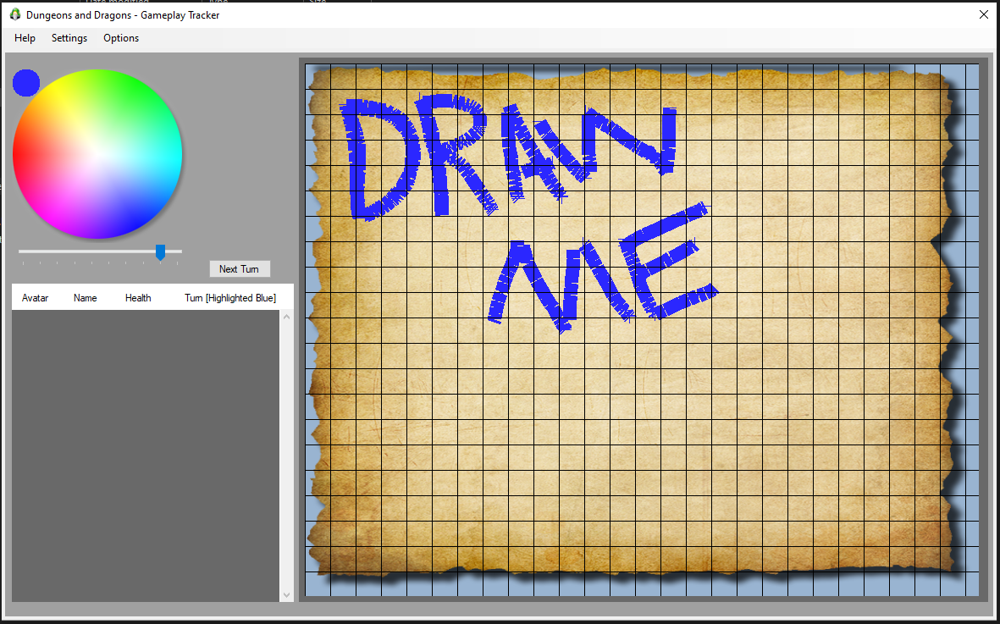

# Dungeons-and-Dragons-Gameplay-Tracker

A C# Winforms application designed for a digital form of d&d gameplay tracking

<b>Requirments</b>
- Visual Studio 2017
- C# Winforms Builder

<b>How To Use</b>
- Add players and enemies from the options drop down menu
- Re-arrange the order of your players and enemies by holding and dragging the avatar by the far right hand side of the list
- Double click on the avatar image in the list to add it to the gameplay field
- Hover your mouse over the avatar on the gameplay field for it to display the avatars name

<b>Key Features</b>
- Custom coded drag and drop system for moving the players up and down the list. (By default, winforms does not have this built in)
- Custom coded color wheel (windows default color selection is terrible)

Note: 
- I do not own the rights to any of the images used. Images were sourced from https://www.hiclipart.com/ royalty free.
- This application is only in aplha stage, its not finished and is a work in progress, bugs may occur.

