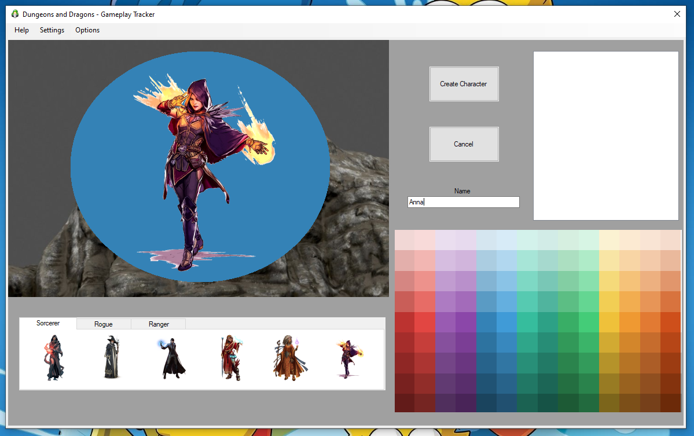

# Dungeons-and-Dragons-Gameplay-Tracker
Requirments:
- Visual Studio 2017
- C# Winforms Builder

Add your players and enemies, assign an avatar, re-order your gameplay list by dragging and dropping, double tap your avatars to add them onto the gameplay field and resize your gameboard through the setting area.
Now get ready to draw your D&D map using the custom made color wheel in the top left of the application, choose your color and draw.

Download the .exe <a href="DungeonsAndDragons.zip" download>Here</a>
Note: 
- I do not own the rights to any of the images used. Images were sourced from https://www.hiclipart.com/ royalty free.
- This application is only in aplha stage, its not finished and is a work in progress, bugs may occur.

